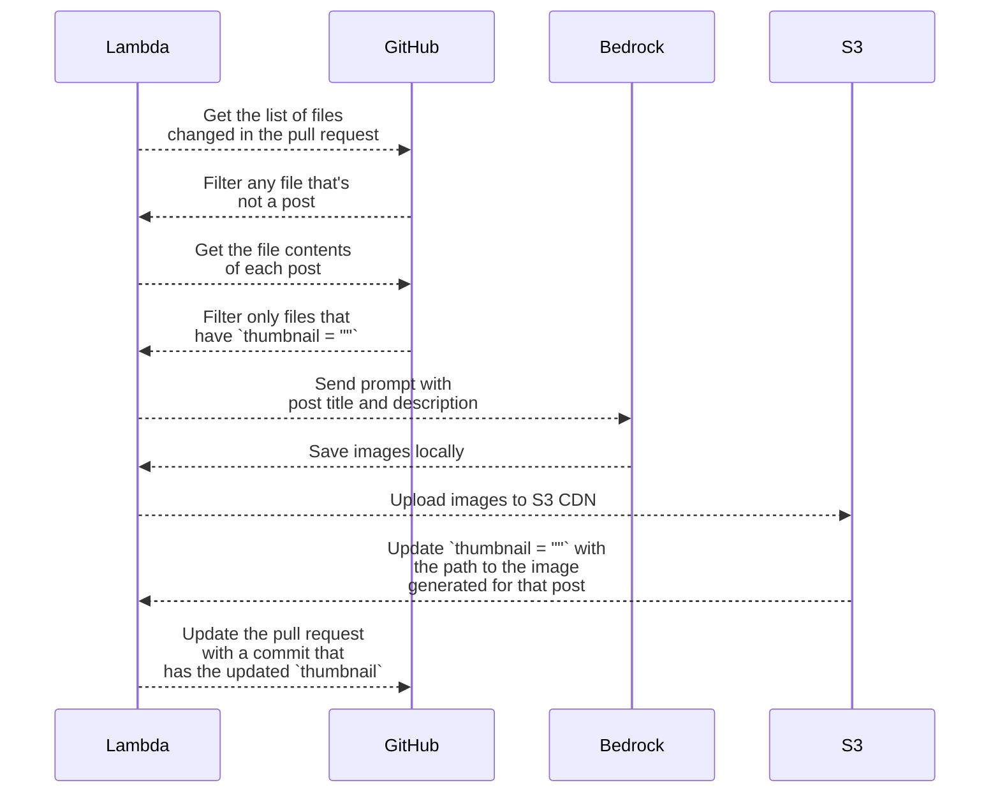

## Blog Post Image Generator

For any posts in a pull request that is missing a thumbnail, this script will generate a blog post image using Amazon Bedrock, upload to S3 (CDN bucket), and update the file in the pull request with the path to the image.

I have code for the two models, sending the title and description of the post:

* [Amazon Titan Image Generator](https://aws.amazon.com/bedrock/titan/) (default)
* [Stable Diffusion XL](https://aws.amazon.com/bedrock/stable-diffusion/)

> Include environment variable `MODEL_TYPE=stability_ai` to use the Stable Diffusion XL model.

This will be a lambda function for now, triggered by an SNS topic.

Other apps will have access to write to this SNS topic, so the image generation process can be triggered by multiple sources.



Expected SNS message format in payload:
```json
{
    "github": {
        "repository_name": "string",
        "pull_request_number": number
    }
}
```